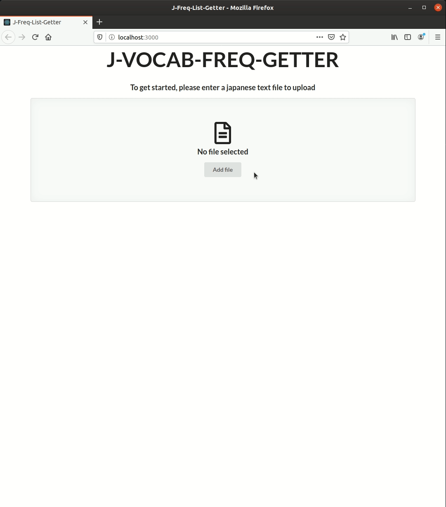

# J-Vocab-Freq-Getter

A web application that outputs the most frequent vocabulary for each JLPT(Japanese Language Proficiency Test) level found in a text file.

## Usage

## Installation

[Frontend](frontend/README.md)  
[Backend](backend/README.md)

## Technologies

- React
- JavaScript/HTML/CSS
- Scala
